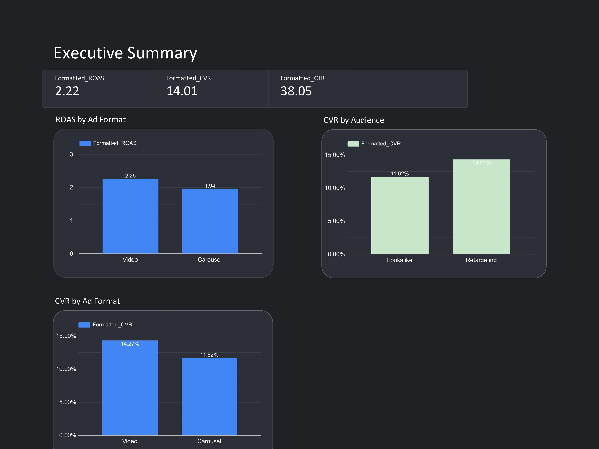

#  Meta Ads Mini Case Study: 123 IQ Test – Free & No Registration

## 📍 Objective
Drive user participation in the **123 IQ Test** during launch week through performance marketing on Meta Ads.

🔗 [View the Interactive Tableau Dashboard](https://lookerstudio.google.com/reporting/98c74962-0ffc-4742-82ed-14afddbe9e14)

---

## 🖼️ Dashboard Preview

---

## 📍 Target Audience
- Lookalike of users who watched past ads >3 seconds  
- Age: 25–40  
- Mobile-first targeting (Facebook & Instagram)

---

## 📍 Platform
**Meta Ads** (Instagram + Facebook)

---

## 📍 Campaign Strategy
- **Campaign Type**: Traffic & Conversions  
- **Ad Format**: A/B test – Video vs Carousel  
- **Budget**: $200 test budget  
- **Key Metrics**:  
  - Click-Through Rate (CTR %)  
  - Conversion Rate (%)  
  - Return on Ad Spend (ROAS)

---

## 📍 Outcome Summary

| Metric           | Video Ad       | Carousel Ad    |
|------------------|----------------|----------------|
| ROAS             | 2.25           | 1.94           |
| Conversion Rate  | 14.27%         | 11.62%         |
| CTR Source       | FB & IG  Reels | Mixed Feeds    | 

- Video ad **outperformed** carousel on both ROAS and Conversion
- **Facebook Reels** drove the majority of engagement
- **Retargeted users** converted at **3× the rate** of cold audience

---

## 📍 Key Learnings
- **Creative format** significantly impacts performance
- **Emotionally engaging messaging** increases click and conversion
- **UGC or testimonial overlays** recommended for next scaling round

---

## 📍 Skills Demonstrated
- Meta Ads campaign structuring
- A/B creative testing logic
- Audience targeting (Lookalike, Retargeting)
- Performance metric interpretation (CTR, ROAS, Conversion)

---

> 📌 *This mock campaign showcases strategic thinking in paid social marketing and performance analysis, with business-ready insights to drive campaign iteration.*
